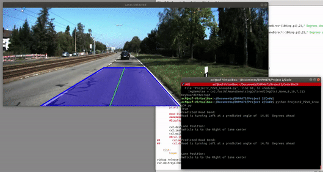

# Lane Detection for Autonomous Vehicles

## Introduction

This project includes the implementation of the following:
- Lane detection for lane departure warning systems in Autonomous Vehicles
- Turn predicition including angle of turning 
- The following was done for the footage availble in ``data/project.avi`` and ``data1/data``

Please find the report for the project [here](https://github.com/kmushty/Lane_Detection/blob/main/Report_Project_2.pdf)

## Dependencies

The following are the project dependencies:
- OpenCV 3.4.2 or above
- Python 3.5

## Code Execution

In order to implement the code:
- Clone the repo
- Run using the following command in the command line ``python3 Problem_2.py``

## Output 

